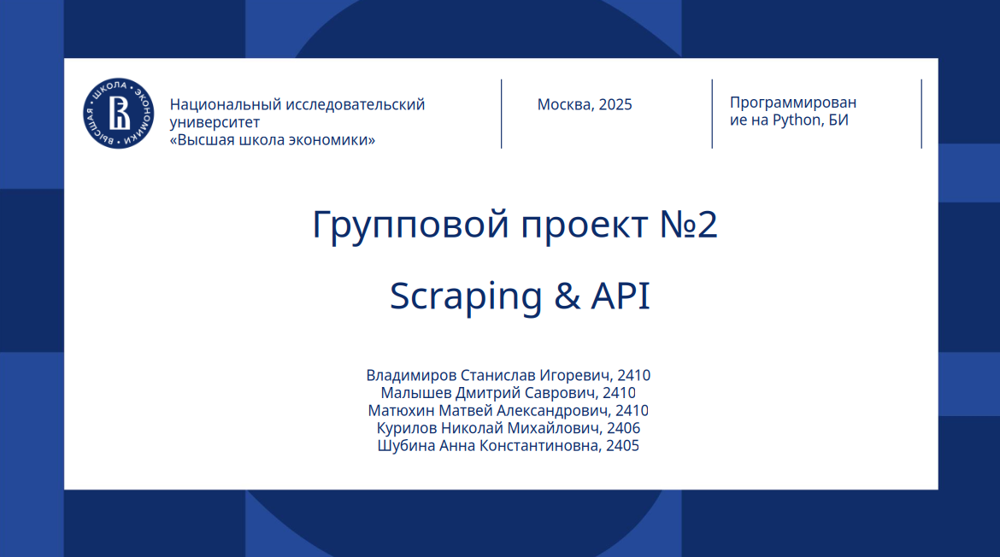

# Gp2_python

## Описание репозитория
Данный репозиторий создан для проекта Gp2 на тему  
- скрапинг
- парсинг через API
- EDA датасета, состоящего из спаршенных данных  

Репозиторий состоит из директории src, включающей в себя скрипты с кодом парсинга и EDA, директории misc, предполагающей нахождение в ней файлов фотографий, директории datasets, где находятся основной, вспомогательный и итоговый датасеты, а также из файлов gitignore и Readme
## Этапы выполнения проекта
### 1. Парсинг данных
#### 1.1 Скрапинг
[сайт для скрапинга](https://kworb.net/spotify/country/global_daily_totals.html)
1. Сначала устанавливаем окружение и необходимые зависимости, чтобы обеспечить запуск ноутбука и доступ к нужным библиотекам для парсинга веб-страниц и обработки данных.
2. Затем импортируем нужные библиотеки: для работы с веб-страницами — Selenium и BeautifulSoup, для обработки данных — pandas, numpy, а для сохранения результатов — pandas DataFrame и экспорт в CSV. 
3. Настраиваем веб-драйвер.
4. Загружаем целевые страницы, проходя по нужной навигации.Сохраняем полученные HTML 
5. Парсим данные: извлекаем необходимую информацию. 
6. Обрабатываем данные: очищаем текст, приводим к единому формату, обрабатываем пропуски, приводим типы данных, выполняем базовую валидацию. 
7. Сохраняем результаты в локальные файлы: CSV в указанный каталог.
#### 1.2 Парсинг через API
[сайт для парсинга через API](https://www.last.fm/)
1. Устанавливаем нужные зависимости.
2. Загружаем и применяем конфигурации: целевые URL, параметры запросов, заголовки, тайм-ауты и политики повторных попыток.
3. Выполняем HTTP-запросы к целевым источникам (API).
4. При использовании API обрабатываем авторизацию (API-ключи, токены) и параметры запроса.
5. Извлекаем целевые поля
6. Приводим данные к единообразному формату.
7. Выполняем базовую валидацию и устранение дубликатов.
8. Сохранение промежуточных и итоговых данных.
9. Реализованы обработчики исключений на сетевые ошибки, ошибки парсинга и тайм-ауты.
10. При неудачных попытках выполняем повторные запросы с экспоненциальной задержкой.
11. Формирование итогового набора данных
12. Объединяем данные в единый DataFrame, выполняем агрегацию или сводку по нужным полям.
13. Сохраняем итоговый CSV
14. Включено логирование уровня DEBUG/INFO для прозрачности выполнения.
### 2. Соединение данных в один дата фрейм
1. Устанавливаем необходимые библиотеки и зависимости, которые потребуются для загрузки данных и обработки таблиц
2. Загружаем данные из исходников
3. мерджим данные методом inner
  
`почему именно inner`
4. Выполняем очистку данных
5. Обогащаем данные новыми признаками, сформированными на основе старых
6. Сохраняем итоговый CSV  

Признаки итогового дата фрейма:  

1. Artist - категориальные​, ник артиста

2. Song - категориальные​, название песни

3. Days in top10 - вещественные​, кол-во дней проведенных в топ 10

4. Peak - вещественные, максимальное место в чарте

5. Days on peak - вещественные​, кол-во дней на пике

6. Days - вещественные​, дни со дня выхода трека на платформе(обновляется при перезаливах)

7. PkStreams - вещественные​, пиковые прослушивания

8. Total - вещественные​, общее кол-во прослушиваний песен spotify

9. listeners - вещественные​, общее кол-во слушателей песен lfm 

10. playcount - вещественные​, общее кол-во прослушиваний песен lfm

11. rank - порядковые​, рейтинг по playcount

12. track_url - категориальные​, url трека

13. artist_url - категориальные​, url артиста

14. duration_min - вещественные​, длительность трека в минутах

15. duration - текстовая строка​, длительность трека в читаемом формате

16. genre - категориальные​, жанр песни

17. genre_description - текстовая строка​, описание жанра

18. artist_listeners - вещественные​, кол-во слушателей артиста lfm

19. artist_playcount - вещественные​, кол-во прослушиваний артиста lfm

20. AvgPerDay - вещественные​, среднее кол-во прослушиваний за день, когда артист был на пике

21. Avg_log10 - вещественные​, логарифмированный AvgPerDay по 10 чтобы сбалансировать вес

22. Days_bonus - вещественные​, бонус за кол-во дней в чарте, дни в чарте тоже логарифмированы по 10

23. Peak_bonus - вещественные​, бонус за место в чарте. Он нормализован чтобы присвоить ему оценку

24. Score - вещественные​, наша оценка треку

25. Score_norm - вещественные, нормализованная оценка трека

### 3. EDA
1. Строим корреляционную таблицу по итоговой таблице
2. Строим графики, отвечающие изначальной бизнес задаче и сформулированным гипотезам
3. Проводим анализ графиков и готовим итоговые бизнес инсайды